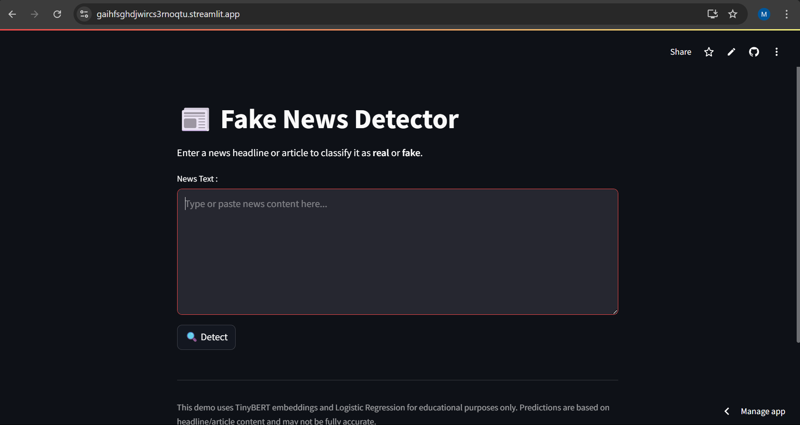

# 📰 Fake News Detection using TinyBERT and Logistic Regression

This project is a **Fake News Detection system** that classifies tech-related news content as either **Real** or **Fake** using **TinyBERT embeddings** and a **Logistic Regression classifier**. It includes a clean **Streamlit** UI for interactive use and achieves an accuracy of **94%**.

## Why TinyBERT instead of TF-IDF?

Traditional approaches like TF-IDF are useful for capturing word frequency, but they **fail to preserve contextual meaning**. TinyBERT, a lightweight version of BERT, offers the following advantages:
-  **Context-aware embeddings**: Understands semantics, not just word counts.
-  **Compact size**: Much faster and more memory-efficient than full BERT.
-  **Transfer learning**: Pre-trained on a large corpus, capturing complex linguistic features.
-  **Better performance**: Demonstrated a substantial accuracy boost (~94%) compared to TF-IDF baselines (~85–87%).

##  Dataset Overview

The dataset consists of:
- `Fake.csv` — 100% fabricated news articles.
- `True1.csv` — authentic news articles.
- ➕ 20 additional manually curated **real** tech news samples.
- ➕ 20 creatively written **fake-like** tech news examples.

Each sample contains:
- `title` — Headline  
- `text` — Article content  
- `label` — 0 = Fake, 1 = Real

All records are concatenated, shuffled, cleaned, and used for training.

---

##  Model Architecture

1. **Data Cleaning**: Removed stopwords, symbols, and punctuation.  
2. **Embedding**: TinyBERT (`prajjwal1/bert-tiny`) used to generate contextual sentence embeddings.  
3. **Classifier**: Trained a Logistic Regression model using the embeddings.  
4. **Evaluation**: Achieved 94% accuracy on the test set.

---

## 🖥 Streamlit App

An interactive GUI built using **Streamlit** allows users to:
- Paste news content  
- Click a button to classify the input  
- See if it's **Real** or **Fake** with a confidence score

 

---

## ⚙️ How to Run Locally

### 🧾 Required Files
Download or clone the following:
```
bert_tiny_logreg_model.pkl
bert_tiny_tokenizer/
bert_tiny_model/
app.py (Streamlit UI script)
```

###  Setup Environment

1. Create a virtual environment (recommended):
```bash
python -m venv fake-news-env
source fake-news-env/bin/activate  # or .\fake-news-env\Scripts\activate on Windows
```

2. Install dependencies:
```bash
pip install torch==2.2.2 streamlit numpy pandas scikit-learn transformers nltk joblib
```

> ⚠ **Important on Torch Version Compatibility**
>
> - If you're using **Python 3.12**, install `torch==2.2.2`  
> - If deploying in **Streamlit Cloud (uses Python 3.13)**, use `torch==2.7.0`  
>
> Find the correct version for your setup: https://pytorch.org/get-started/locally/

---

## ▶️ Run the App

```bash
streamlit run app.py
```

---

## 📈 Performance

-  Accuracy: **94%**
-  Lightweight BERT usage
-  Fast classification with Logistic Regression

---

## 🧪 Sample Output

```
Prediction: FAKE NEWS (95.21% confidence)
```

---

## 📁 Folder Structure

```
.
├── Fake.csv
├── True1.csv
├── bert_tiny_logreg_model.pkl
├── bert_tiny_tokenizer/
│   └── tokenizer_config.json, vocab.txt, etc.
├── bert_tiny_model/
│   └── config.json, pytorch_model.bin, etc.
├── app.py  
└── README.md
```

---

## 📜 License

This project is for **educational/demo purposes only**. Predictions should not be used as legal or journalistic confirmation.


